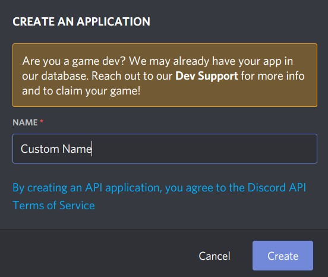
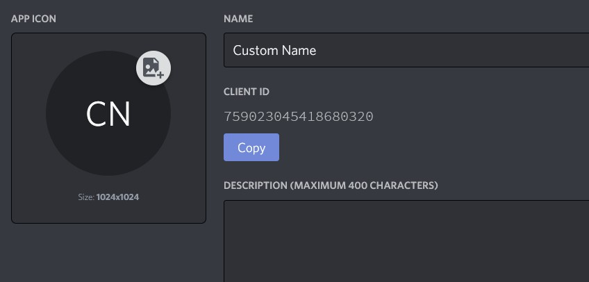
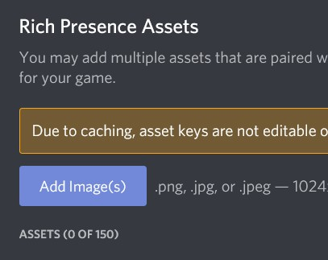

# hoạt động-tùy chỉnh-discord
Hoạt động tùy chỉnh cho người dùng trên Discord

## Cài đặt
1. Tải xuống hoặc sao chép kho lưu trữ này.

2. Cài đặt tất cả các yêu cầu 
   ```bash
   pip install -r requirements.txt
   ```
   
## Cách sử dụng
Đây là cách nó sẽ trông như thế nào - 


1. Truy cập trang [Discord Developer's](https://discord.com/developers/applications) để tạo một ứng dụng mới. 

2. Nhấp vào "New Application". <br>
   

3. Đặt tên cho hoạt động của bạn. <br>
   
   
4. Sao chép ID khách hàng (client ID) <br>
   

5. Dán ID khách hàng vào tệp ``config.ini``.
   ```
   [CLIENT]
   client_id=759023045418680320
   ```
      
6. Bạn có thể tải lên các tài sản hình ảnh dưới Rich Presence -> Art Assets. <br>
   

7. Chỉnh sửa ``base_activity`` trong ``app.py`` để thêm văn bản và hình ảnh tùy chỉnh của riêng bạn. Kiểm tra Rich Presence -> Visualizer để xem cách hoạt động của các hình ảnh.
   ```python
   base_activity = {
      'details': 'Chi tiết tùy chỉnh',
      'state' : 'Trạng thái tùy chỉnh',
      'assets': {
          'large_image': 'tên_hình_ảnh_lớn',
          'large_text': 'Văn bản hình ảnh lớn',
          'small_image': 'tên_hình_ảnh_nhỏ',
          'small_text': 'Văn bản hình ảnh nhỏ'
      },
      'party': {
          'size': [1, 5]
      }
   }
    ```
      
8. Chạy chương trình
   ```bash
   python app.py
   ```
   
## Ghi chú
Đọc [Wiki](https://github.com/k3rn31p4nic/discoIPC/wiki) để xem các lớp và phương thức có sẵn của discoIPC và biết cách sử dụng chúng.

## Lời cảm ơn
Cảm ơn [dangkhoa2004](https://github.com/dangkhoa2004) vì thư viện [discoIPC](https://github.com/k3rn31p4nic/discoIPC) của anh ấy.